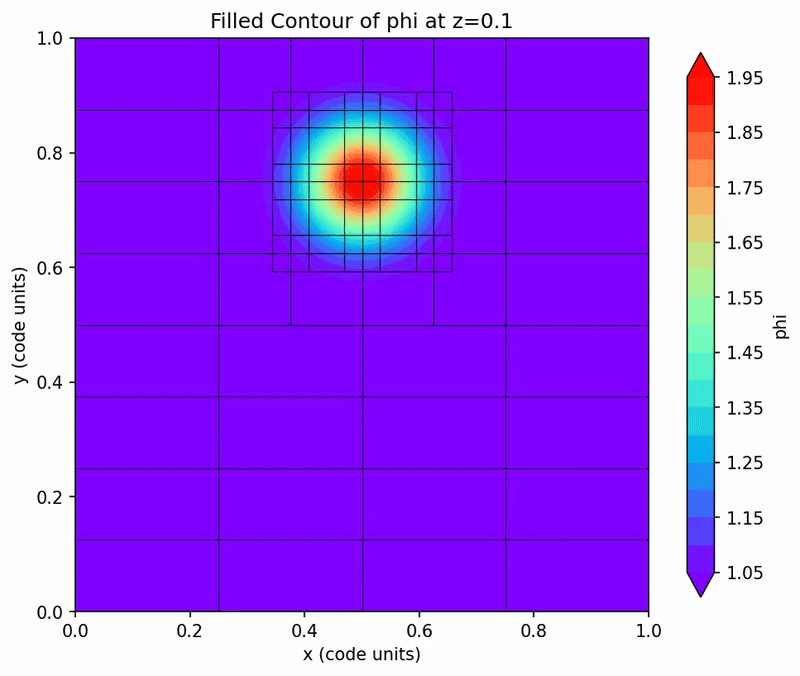

# Example for using yt in parallel 

This example gives the Python scripts for processing amrex plt files using yt with MPI. 
For eg., if there are 128 files and 64 MPI ranks, then each rank processes 2 files each. 
There is no parallelization within the processing of a single plot file. Here are the steps 
to process the plot files using yt.

```
cd PythonScripts
srun -n 64 python3 PlotAMReXFile_Parallel.py <path-to-plofiles-folder> --var=<variable-to-plot> --axis=<slice-axis> --location=<location-along-axis>
```

An example is 
```
cd PythonScripts
srun -n 64 python3 PlotAMReXFile_Parallel.py ../ --var=phi --axis=z --location=0.1
```
This processes the files with yt using 64 MPI ranks. It writes images of 2D z-slices at a location 
of z=0.1. The images are written in `../Images/`




